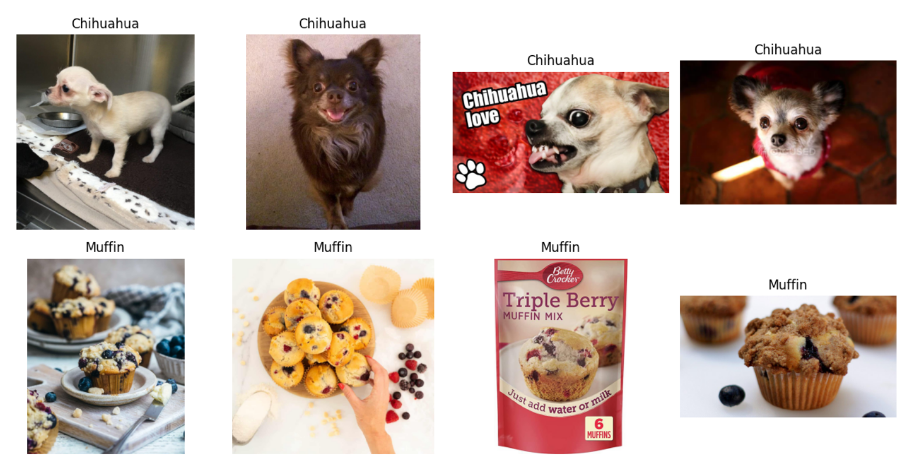
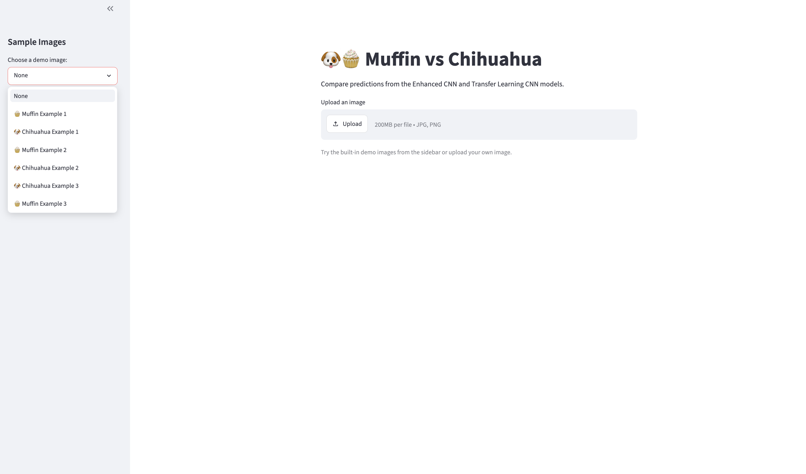

# 🐶🧁 Muffin vs Chihuahua Image Classification

## Project Overview

This project explores image classification using Convolutional Neural Networks (CNNs) and Transfer Learning. The goal is to distinguish between images of Chihuahuas and muffins, a popular computer vision challenge inspired by the "Muffin vs Chihuahua" internet meme.

Four models were developed and evaluated:

1. Baseline CNN
2. Regularized CNN
3. Enhanced CNN
4. Transfer Learning CNN (MobileNetV2)

The project follows a complete machine learning workflow including data exploration, model development, evaluation, improvement, deployment, and performance comparison.

---

## Inspiration

This project was inspired by the well-known "Muffin vs Chihuahua" meme and CAPTCHA-style image puzzles that challenge users to tell the difference between blueberry muffins and Chihuahuas. While humorous, the meme provides an excellent example of a computer vision problem where two classes share surprisingly similar visual features.

---

## Dataset

<p align="center">
  
</p>

The dataset consists of images belonging to two classes:

* Chihuahua
* Muffin

Images were resized to 128×128 pixels and divided into training, validation, and test sets.

### Dataset Distribution

| Class | Training Images | Test Images |
|---------|---------:|---------:|
| Chihuahua | 2,559 | 640 |
| Muffin | 2,174 | 544 |
| **Total** | **4,733** | **1,184** |

Total number of images: **5,917**

The dataset is relatively balanced, with slightly more Chihuahua images than muffin images. A validation set was created from the training data during model development and hyperparameter tuning.

---

## Models Implemented

### Baseline CNN

Initial CNN architecture used as a starting point for experimentation.

**Test Accuracy:** 87.67%

### Regularized CNN

Improvements:

* Data augmentation
* Dropout
* Early stopping

**Test Accuracy:** 91.30%

### Enhanced CNN

Improvements:

* Additional convolutional layer
* Refined architecture

**Test Accuracy:** 92.57%

### Transfer Learning CNN

Transfer learning using MobileNetV2 pretrained on ImageNet.

**Test Accuracy:** 98.06%

---

## Model Comparison

| Model                 |   Accuracy |
| --------------------- | ---------: |
| Baseline CNN          |     87.67% |
| Regularized CNN       |     91.30% |
| Enhanced CNN          |     92.57% |
| Transfer Learning CNN | **98.06%** |

The Transfer Learning CNN achieved the highest performance and demonstrated superior generalization compared to the custom CNN architectures.

### Transfer Learning Confusion Matrix


---

## Live Demo

The application was built using Streamlit and deployed on Render.

**Live Application:**

https://chihuahua-muffin.onrender.com/

Features:

* Upload your own image
* Compare Enhanced CNN and Transfer Learning CNN predictions
* View prediction confidence scores
* Test built-in sample images
* Explore challenging and ambiguous examples

---

## Application Screenshot

<p align="center">
  
</p>

---

## Example Results

The project includes examples of:

* Correct classifications
* Challenging classifications
* Failure cases
* Out-of-scope images (e.g., birthday cake, dachshund)

These examples demonstrate both the strengths and limitations of image classification models.

---

## Technologies Used

* Python
* TensorFlow / Keras
* NumPy
* Matplotlib
* Scikit-learn
* Streamlit
* Render

---

## Repository Structure

```text
.
├── CNNproject.ipynb
├── README.md
├── requirements.txt
├── images/
└── .gitignore
```

---

## Deployment Notes

An initial deployment attempt was made using Streamlit Community Cloud. However, deployment was unsuccessful due to TensorFlow dependency compatibility issues within the cloud environment.

The application was successfully deployed using Render, which provided a compatible Python environment for TensorFlow.

---

## Author

Victoria Hart

AI Developer Program (AIDEV25S)